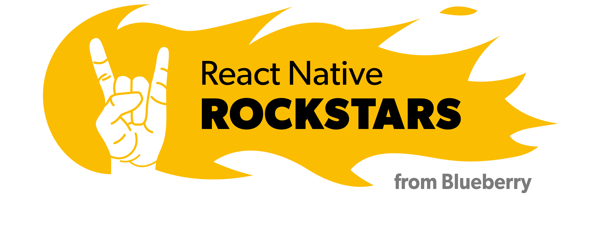
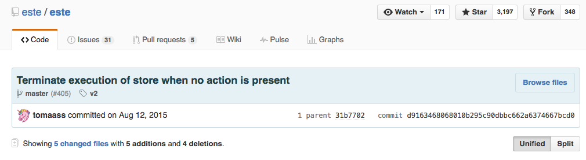
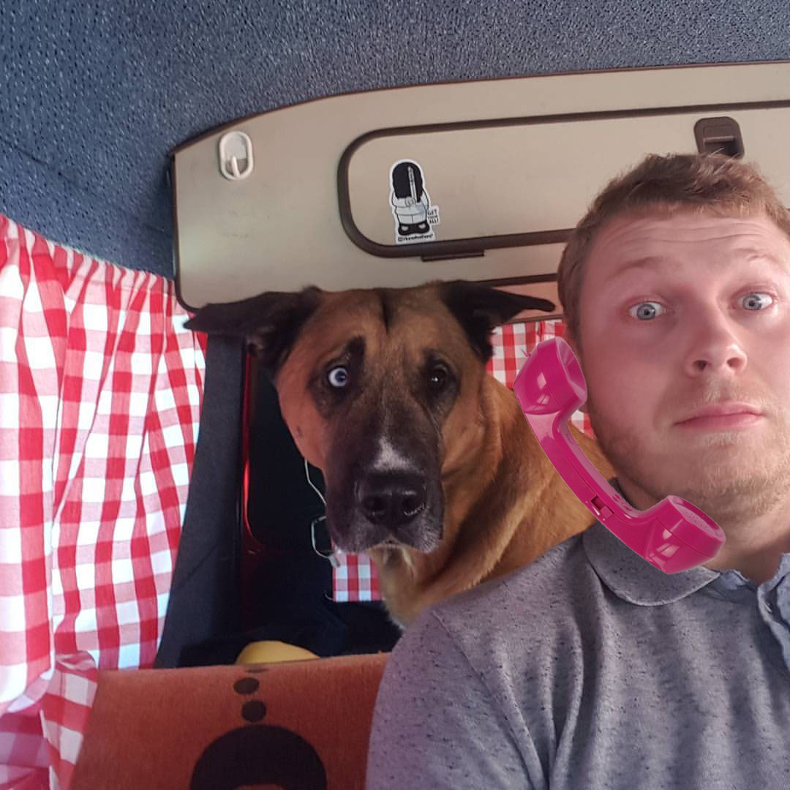
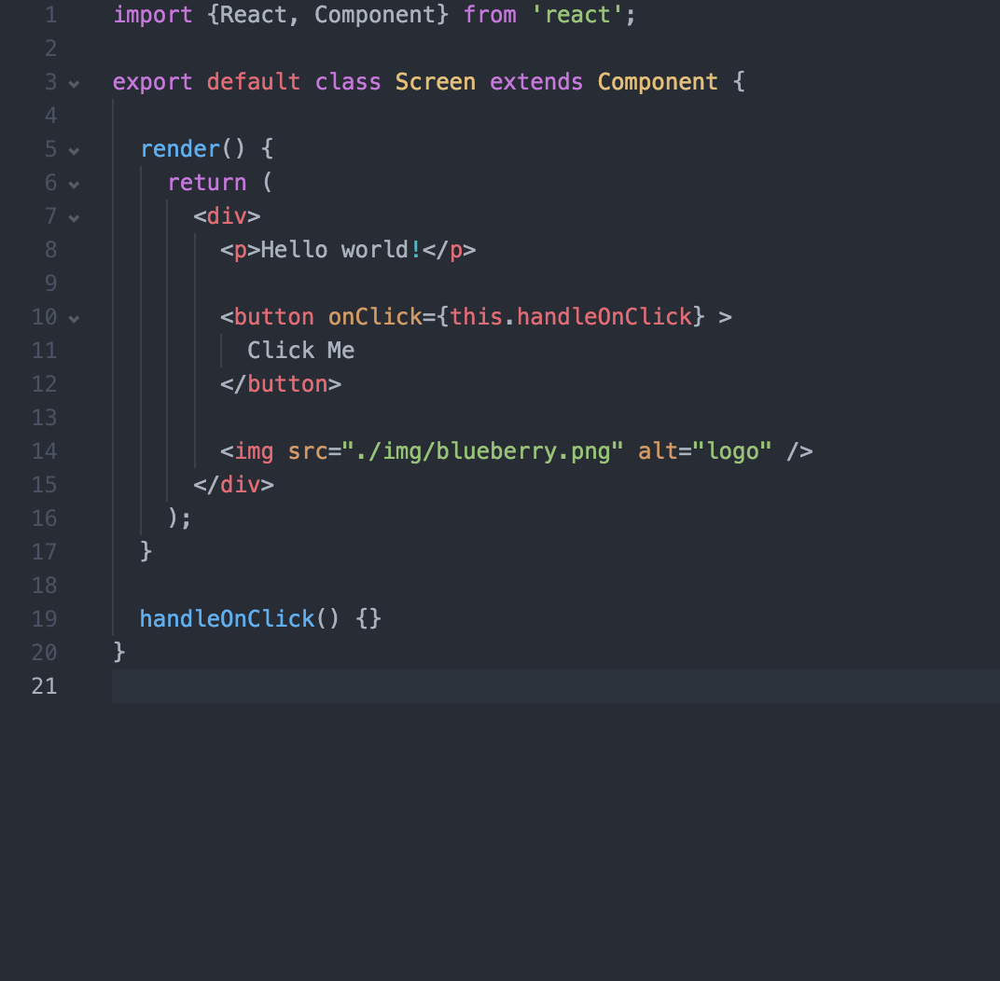

build-lists: true



---

BlueberryMeetUp - React Native

```
$ git commit -m "Initial Commit" --author="Tomáš Šorejs"
```
---
```
$ git commit -m "Initial Commit" --author="Tomáš Šorejs"
```
---

```
$ git commit -m "Initial Commit" --author="Tomáš Šorejs"
$ git commit -m "Add styles" --author="Jan Maršíček"
```
---

```
$ git commit -m "Initial Commit" --author="Tomáš Šorejs"
$ git commit -m "Add styles" --author="Jan Maršíček"
$ git commit -m "Add Android Support" --author="Antonín Simerský"
```
---

```
$ git commit -m "Initial Commit" --author="Tomáš Šorejs"
$ git commit -m "Add styles" --author="Jan Maršíček"
$ git commit -m "Add Android Support" --author="Antonín Simerský"
$ git commit -m "Q&A" --author="React Native Rockstars"

```

---

```
$ git commit -m "Initial Commit" --author="Tomáš Šorejs"
$ git commit -m "Add styles" --author="Jan Maršíček"
$ git commit -m "Add Android Support" --author="Antonín Simerský"
$ git commit -m "Q&A" --author="React Native Rockstars"

$ react-native run-meetup
```
---
# Tomáš Šorejs
### developer at Blueberry
### team leader of React Native Rockstars

#### all social sites knows me as *tomaass* or *_tomaass*
#### tsorejs@blueberryapps.com

^ Představit sebe, svoji roli v BB a náš team

---


---

# Můj příběh

^ Baltazar, Delphi, ČVUT, Ruby

---


^
SGP Baltazar
90 léta
programovací jazyk na bázi C s 2D grafickým rozhraním

---

# Assembler, Delphi, PHP

^ instrukce, PIC16F877A

---

# Java, C++

---


---


---


^
Zkusil jsem to nejdriv jako programator na volne noze
Kazdy nekdy zabloudi

---


---


---


---


^Když jsem po dvou letech konečně zvládal něco udělat přišel javascript

---


^ Věc na který jsem se naučil React
^ Frontend k api v Ruby on Rails
^ První commit 30.7.2015

---



^ 12.8.2016

---


---


# Co je Native aplikace?

^ Aplikace vytvořená pro určitou platformu, která může využívat všechny její možnosti.

---


---


---


---


---


---


---

# Cross-Platform

---


---


^ vypadá jinak - styleguides
rychlost
limitace native
rendering webview

---


---


- Javascript
- React
- UI je Native
- možnost použití nativního kódu

---

#[FIT] ~~Write once, run anywhere~~
#[FIT] Learn once, write anywhere

^
is a slogan created by Sun Microsystems to illustrate the cross-platform benefits of the Java language

---


# [FIT] History of Native

- 01/2015 React Conf 2015
- 03/2015 public release - only iOS
- 09/2015 Android support

^ září 2015 Android support
^ React.js Conf 2016 - Nick Schrock - Keynote - google byl taky 25 search engine
^ spousta lidí přešlo ze Swiftu

---



^ leden

---


^ Nastínit stav a velikost aplikace, požadavek na mobilní verzi

---


---


^ Este, REact Native 0.17 - dneska máme 0.26 a po meetUpu udelame update na 28

---


^ team Já + Maršák, paralelní vývoj s web verzí - David Srbsko
^ zvolili jsme pouze iOS komponenty

---


---




---
# Výsledek

^ Popsat závěr co se nám povedlo před sv. Antonínem

---

# Sdílení kódu Browser a Native part

^ Popsat, co se sdílí, ukázat co jsem změřil

---

# Závěr z React Native

^ Velice jednoduchý napojení na React Appku, velice jednoduchý na naučení - kódu rozumí i Maršák - soustředit se na tuhle část, nezabíhat do multiplatforem

# Otázky
